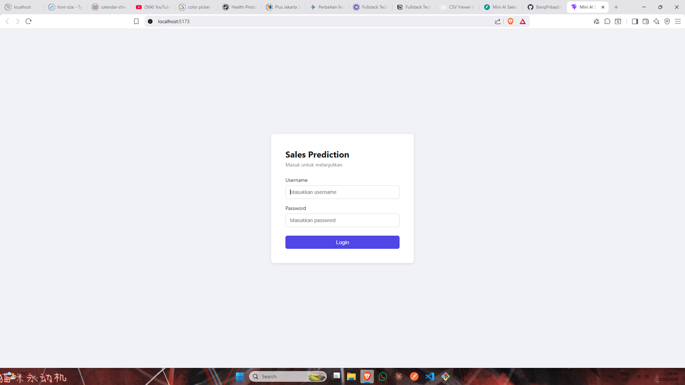
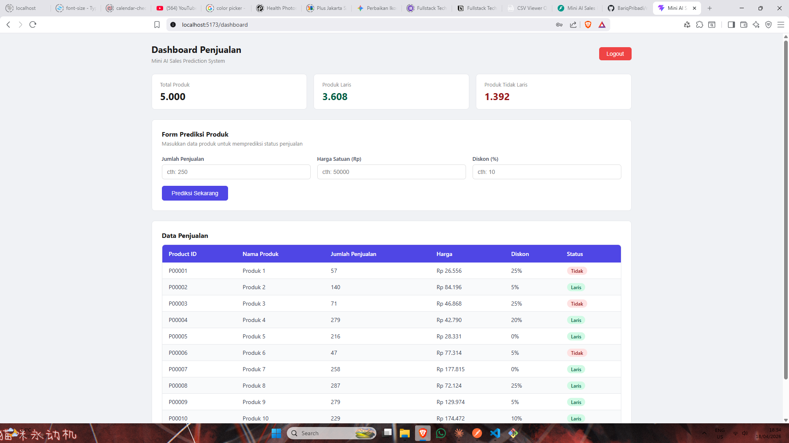
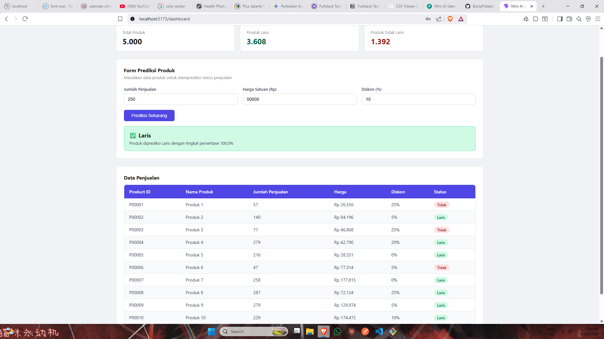
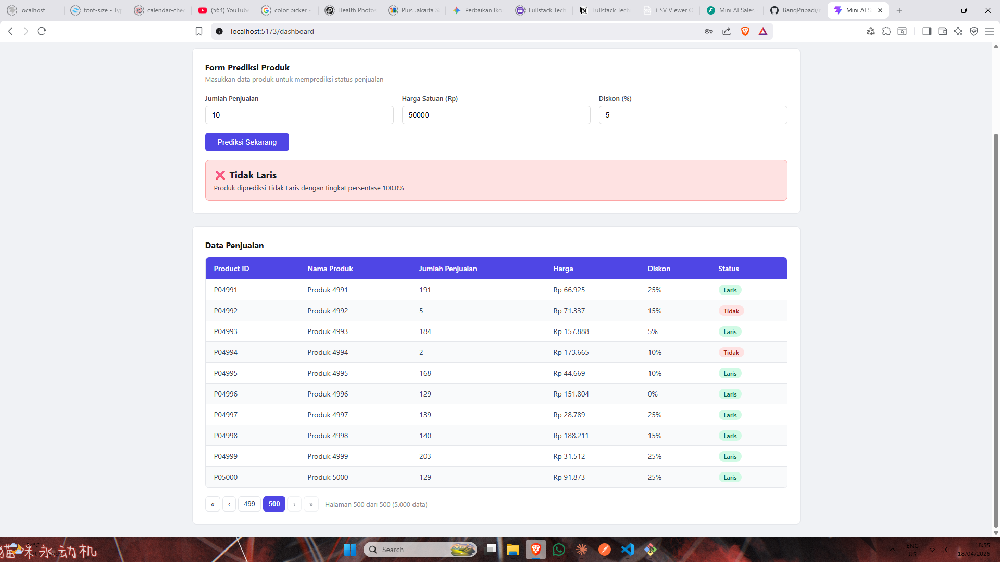

# Mini AI Sales Prediction System

Sistem prediksi status penjualan produk berbasis Machine Learning. Pengguna dapat melihat data penjualan dan memprediksi apakah suatu produk akan **Laris** atau **Tidak Laris** berdasarkan jumlah penjualan, harga, dan diskon.

---

## Tech Stack

- **Frontend:** React 19, Vite, Axios, React Router DOM
- **Backend:** Python 3.14, FastAPI, Uvicorn
- **Machine Learning:** Scikit-learn (Logistic Regression), Pandas, NumPy, Joblib
- **Auth:** JWT via python-jose, disimpan sebagai httpOnly Cookie

---

## Struktur Project

```
mini-sales-prediction-system/
├── backend/
│   ├── app/
│   │   ├── routers/
│   │   │   ├── auth.py       # POST /login, POST /logout, GET /me
│   │   │   ├── sales.py      # GET /sales
│   │   │   └── predict.py    # POST /predict
│   │   ├── schemas/
│   │   │   └── request.py    # Pydantic schema
│   │   ├── auth.py           # JWT logic
│   │   ├── config.py         # Environment config
│   │   └── main.py           # Entry point FastAPI
│   ├── .env                  # Environment variables (tidak di-commit)
│   └── .env.example          # Template environment variables
├── frontend/
│   └── src/
│       ├── pages/
│       │   ├── Login.jsx
│       │   └── Dashboard.jsx
│       ├── components/
│       │   ├── SalesTable.jsx
│       │   ├── PredictForm.jsx
│       │   └── ProtectedRoute.jsx
│       ├── services/
│       │   └── api.js        # Axios instance & API calls
│       └── App.jsx
│   ├── .env                  # Environment variables (tidak di-commit)
│   └── .env.example          # Template environment variables
├── ml/
│   ├── train.py              # Script training model
│   ├── model.pkl             # Model hasil training
│   ├── scaler.pkl            # Scaler hasil training
│   └── evaluation.txt        # Hasil evaluasi model
├── data/
│   └── sales_data.csv
└── README.md
```

---

## Cara Menjalankan

### Prasyarat

- Python 3.14+
- Node.js 18+

---

### 1. Machine Learning — Training Model

```bash
cd ml
python -m venv venv
source venv/Scripts/activate   # Windows
# source venv/bin/activate     # Mac/Linux

pip install pandas scikit-learn joblib numpy
python train.py
```

Setelah selesai, file `model.pkl` dan `scaler.pkl` akan terbuat otomatis di folder `ml/`.

---

### 2. Backend — FastAPI

```bash
cd backend
python -m venv venv
source venv/Scripts/activate   # Windows
# source venv/bin/activate     # Mac/Linux

pip install fastapi uvicorn python-jose[cryptography] pandas scikit-learn joblib numpy python-multipart pydantic-settings python-dotenv
```

Salin file environment lalu sesuaikan nilainya:

```bash
cp .env.example .env
```

Generate `SECRET_KEY` yang aman:

```bash
python -c "import secrets; print(secrets.token_hex(32))"
```

Jalankan server:

```bash
uvicorn app.main:app --reload
```

Backend berjalan di `http://localhost:8000`  
Dokumentasi API (Swagger): `http://localhost:8000/docs`

---

### 3. Frontend — React

```bash
cd frontend
cp .env.example .env
npm install
npm run dev
```

Frontend berjalan di `http://localhost:5173`

---

### Kredensial Login

```
Username : admin
Password : admin123
```

---

## Screenshots

### Login


### Dashboard


### Prediksi Laris


### Prediksi Tidak Laris


---

## API Endpoints

| Method | Endpoint   | Auth | Deskripsi                         |
| ------ | ---------- | ---- | --------------------------------- |
| POST   | `/login`   | ❌   | Login, set httpOnly cookie        |
| POST   | `/logout`  | ❌   | Logout, hapus cookie              |
| GET    | `/me`      | ✅   | Verifikasi token, return username |
| GET    | `/sales`   | ✅   | Ambil semua data penjualan        |
| POST   | `/predict` | ✅   | Prediksi status produk            |

### Contoh Request `/predict`

```json
{
    "jumlah_penjualan": 250,
    "harga": 50000,
    "diskon": 10
}
```

### Contoh Response `/predict`

```json
{
    "status": "Laris",
    "keterangan": "Produk diprediksi Laris dengan tingkat persentase 100.0%"
}
```

---

## Machine Learning

- **Problem:** Binary classification (Laris / Tidak Laris)
- **Model:** Logistic Regression
- **Fitur input:** `jumlah_penjualan`, `harga`, `diskon`
- **Dataset:** 5.000 data produk, split 80% training / 20% testing
- **Hasil evaluasi:** Accuracy **99.60%**

---

## Design Decisions

**Logistic Regression** dipilih karena sederhana, cepat, dan mudah diinterpretasi untuk kasus klasifikasi biner. Dengan akurasi 99.60% pada dataset ini, model yang lebih kompleks seperti Random Forest tidak diperlukan.

**httpOnly Cookie** digunakan untuk menyimpan JWT token, bukan localStorage, karena tidak dapat diakses oleh JavaScript sehingga lebih tahan terhadap serangan XSS.

**Scaler disimpan terpisah** (`scaler.pkl`) agar input prediksi di backend menggunakan transformasi yang identik dengan saat training, mencegah hasil prediksi yang tidak akurat akibat perbedaan skala.

**Data penjualan di-load sekali saat startup** (bukan per-request) karena data bersifat statis dari CSV, konsisten dengan cara model ML di-load. Mengurangi I/O disk pada setiap request.

**Pagination di frontend** diterapkan untuk menghindari render 5.000 baris sekaligus. Data di-fetch sekali lalu dipaginasi di sisi klien per 10 baris.

**ProtectedRoute** menggunakan endpoint `GET /me` untuk verifikasi token sebelum render dashboard. Diperlukan karena token disimpan di httpOnly cookie yang tidak bisa dibaca JavaScript secara langsung.

---

## Asumsi

- Dummy user (`admin/admin123`) digunakan karena scope test tidak mencakup manajemen user dan database.
- File `model.pkl` dan `scaler.pkl` tidak di-commit ke git. User perlu menjalankan `train.py` terlebih dahulu untuk men-generate model.
- Nilai `secure=False` pada cookie digunakan karena environment development tidak menggunakan HTTPS. Pada production, nilai ini harus diubah menjadi `True`.
